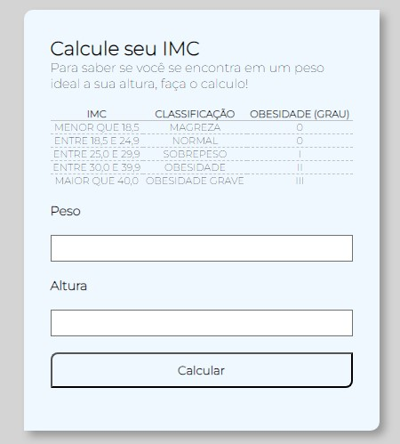

<h1>Cálculo IMC</h1> 

> Status do Projeto: :heavy_check_mark: CONCLUIDO :heavy_check_mark:

### Tópicos 

:small_blue_diamond: [Descrição do projeto](#descrição-do-projeto)

:small_blue_diamond: [Captura de tela](#captura-de-tela-dash)


## Descrição do projeto 

<p align="justify">
  O usuário poderá fazer um cálculo de IMC, para saber se está com seu peso ideal ou se está acima do ideal.
</p>

## Captura de tela :dash:




## Como rodar a aplicação :arrow_forward:

No terminal, clone o projeto: 

```
git clone https://github.com/BryanCarlos/calculo-IMC.git
```

E então abra a o arquivo index.html!


## Como rodar os testes

Coloque um passo a passo para executar os testes

```
Insira o seu peso (em KG) e logo depois insira sua altura (em M)
```
